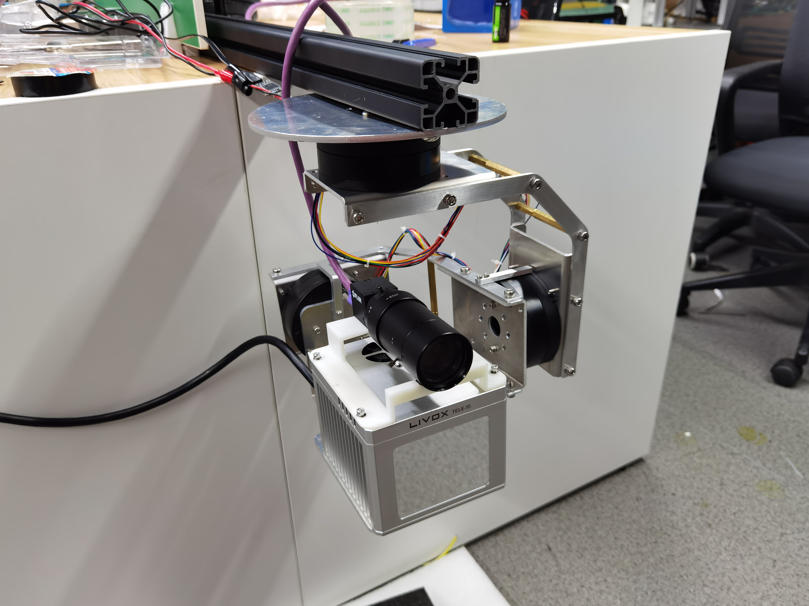

# Platform Diver

<div align=center></div>

## Content

- [Introduction](#Introduction)
- [Dependence](#Dependence)
- [Usage](#Usage)

## Introduction

A motor serial communication driver for a three-axis stabilizing platform using SimpleBGC serial protocol.

## Prerequisite

- ros
- ros-melodic-serial

## Usage

### 1. Build

1. Build a workspace

```shell
mkdir ws/src
```

2. Clone this repository in `/ws/src`

```shell
cd ws/src
git clone https://github.com/HoEmpire/pointcloud-fusion.git
```

3. Build the files

```shell
catkin_make
```

4. Run the node

```shell
source devel/setup.zsh
roslaunch platform_driver platform_driver
```

### 2. Config

We can modify the parameters in`/pointcloud_fusion/cfg/pointcloud_fusion.yaml`

#### pointcloud_fusion.yaml

```yaml
basic:
  debug_output_scan: false # output  the current yaw when scanning
  debug_output_encoder: false # output the encoder reading result  in real-time
  init_time: 10 #platform initialization time
  cycle_time_second: 0.05 #the serial communication time
  reset_speed: 5.0 # the time for reset from scan/track to free status
  transient_time: 1.0 # aborted
  pitch_in_yaw_control: 0.0 # the pitch offset in yaw control mode

scan:
  init_time: 2.0 #aborted

track:
  track_speed_limit: 500.0 #the maximum speed in tracking deg/s (the  actual performance is slower)
```

### 3. command message

You can use ` rostopic pub /write platform_driver/command` to control the platform

#### 3.1 Explanation of the control command

```cpp
uint8 command
// command list
byte POWER_ON = 0
byte POWER_OFF = 1

byte ANGLE_CONTROL = 2 // both speed and angle should be provided
byte SPEED_CONTROL = 3 // only speed should be provided

byte ENCODER_CALIBRATI0N = 4 // calibrate the offset of the encoder
byte RELATIVE_YAW_CONTROL = 5 //control the relative yaw

byte SET_ROLL_P = 11
byte SET_PITCH_P = 12
byte SET_YAW_P = 13

byte SET_ROLL_I = 21
byte SET_PITCH_I = 22
byte SET_YAW_I = 23

byte SET_ROLL_D = 31
byte SET_PITCH_D = 32
byte SET_YAW_D = 33

//only used in angle_control mode and speed_control mode
float32 roll_angle
float32 pitch_angle
float32 yaw_angle
float32 roll_speed
float32 pitch_speed
float32 yaw_speed

//the pid value used in setting pid of 3-axis motors
uint8 set_pid_value

// Free Status: mode = 0  (command list only works in FREE status)
// Scan Status: mode = 1
// Track Status: mode = 2 (currently track mode is the relative yaw control mode , the track yaw is the relative yaw angle in platform frame)
uint8 mode

// (in mode =1)
// scan_range(in degree): the yaw will scan from -scan_range to scan_range in platform frame (e.g. scan_range =  90.0, then the platform will scan the yaw angle from -90° to 90°
//scan_cycle_time ( in second): the time for the platform to complete a  cycle (in case of scan_range =  90.0, the yaw angle  0->90°->-90°->0° is a cycle)
float32 scan_range
float32 scan_cycle_time

// (in mode =2) relative yaw angle in platform frame
float32 track_yaw


```
